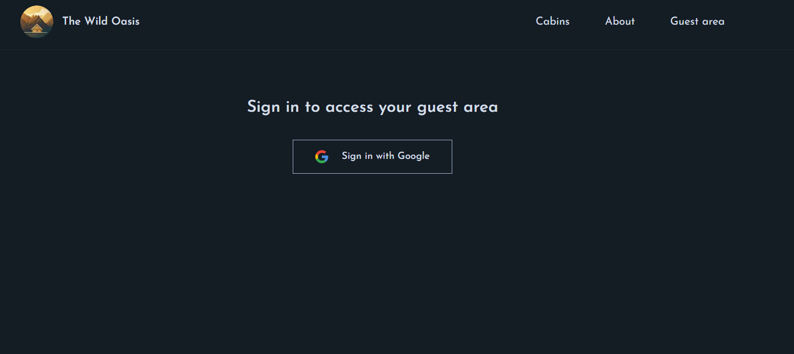
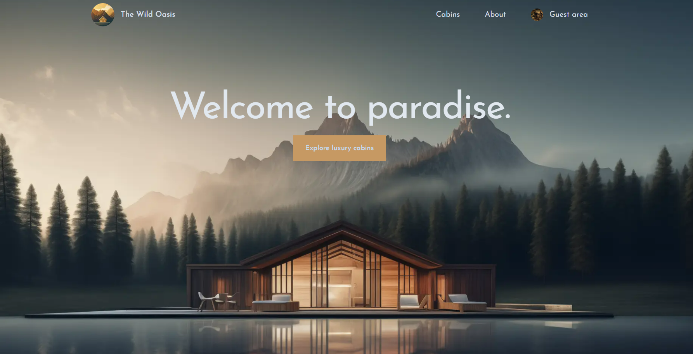
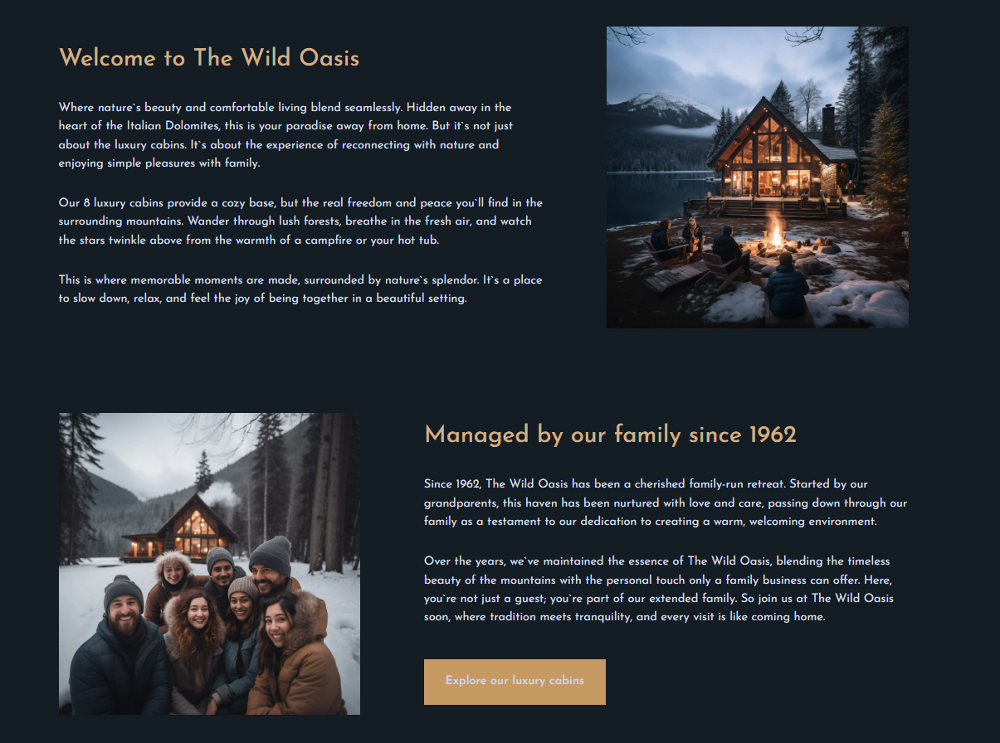
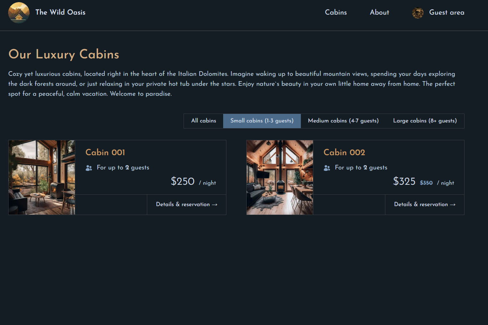
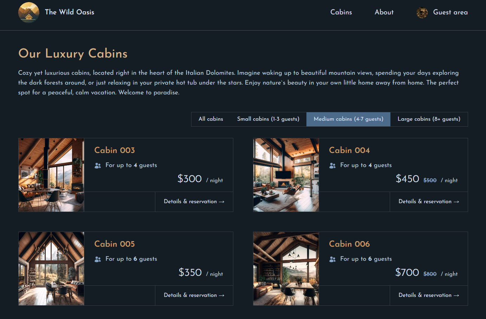
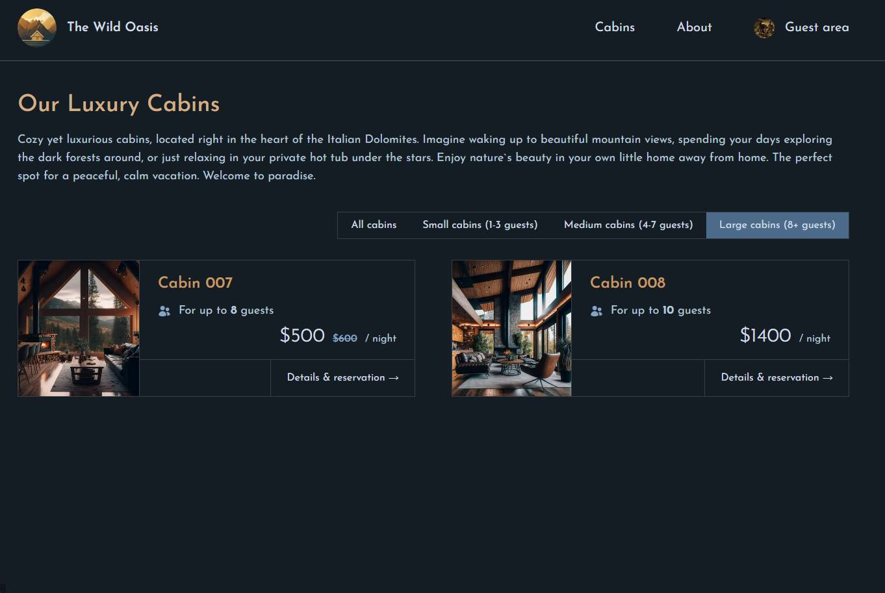
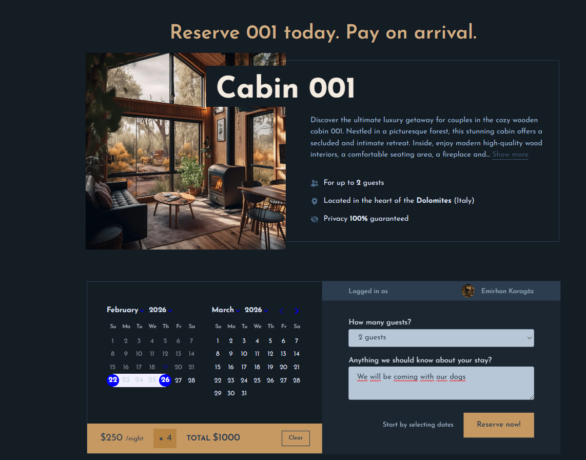
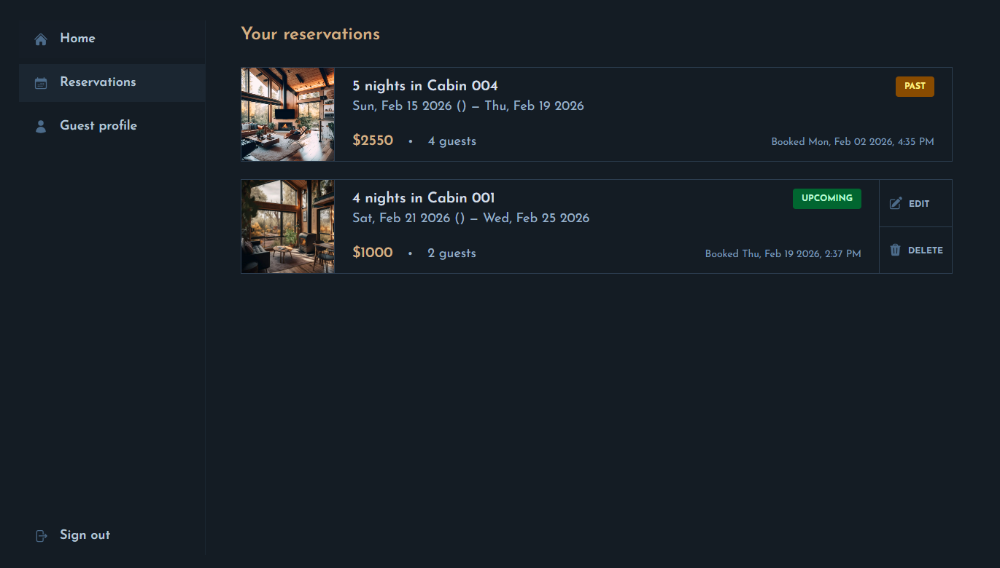
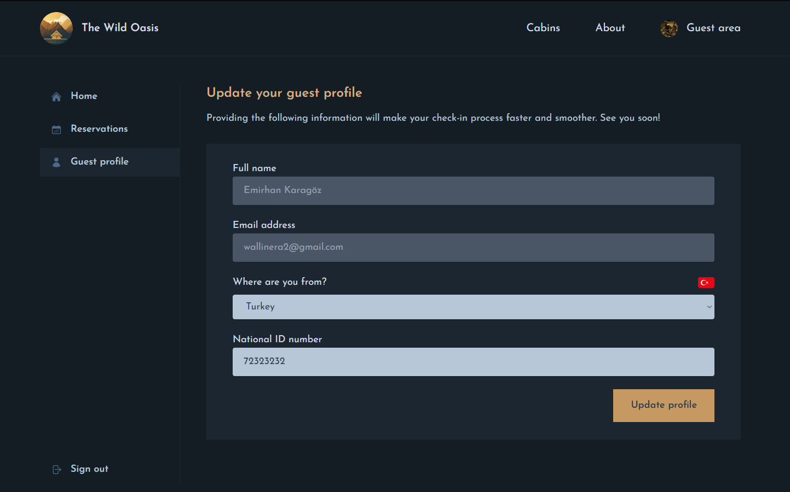

# The Wild Oasis

** A hotel web app, where guests can book cabins, manage their reservations and their profile **

---

## Table of Contents

1. [About the Project](#about-the-project)
2. [Features](#features)
3. [Screenshots](#screenshots)
4. [Usage](#usage)
5. [License](#license)
6. [Contact](#contact)

---

## About the Project

Welcome to The Wild Oasis, a guest-facing web application that invites visitors to explore and book luxury cabins in a serene nature retreat. Built with modern web technologies, this platform features an intuitive interface for browsing cabins, learning about the property, and accessing a dedicated guest area — all designed to deliver a seamless reservation experience.

## Features

- **Cabin Exploration**: Browse beautifully presented cabins with detailed descriptions, pricing, and amenities.
- **Seamless Booking**: Make reservations effortlessly with a clean and intuitive booking flow.
- **Guest Dashboard**: View your upcoming stays, manage your reservations, and update personal details.
- **Secure Authentication**: Log in safely to access your personalized guest area and booking history.
- **Responsive Design**: Optimized for a smooth experience across desktop, tablet, and mobile devices.
- **Real-Time Availability**: Check up-to-date cabin availability before confirming your stay.

---

## Screenshots

### Login Page

### Home Page

### About Page

### Small Cabins

### Medium Cabins

### Large Cabins

### Reservation & Cabin Detail

### Managing Reservations

### Editing Reservation

### Updating Guest Profile

---

## Usage

1. **Log In**: Logging in through google accounts.
2. **Navigate**: Use the sidebar to navigate through different sections (Cabins, About, Guests area).
3. **Make a reservation**: Select your stay dates and confirm a reservation through the streamlined booking flow.
4. **Access Guest Dashboard**: View your upcoming stays, manage existing bookings, or update your personal information.
5. **Log Out**: Securely log out when you are done managing your stay.

---

## License

Distributed under the MIT License. See `LICENSE` for more information.

---

## Contact

Emirhan Karagöz - [emirhan-karagoz1@hotmail.com](mailto:emirhan-karagoz1@hotmail.com)

Project Link: [GitHub Repository](https://github.com/Wallinera/the-wild-oasis-guest)

Live Site URL: [wildoasis.vercell.app](https://the-wild-oasis-guest-six.vercel.app)
